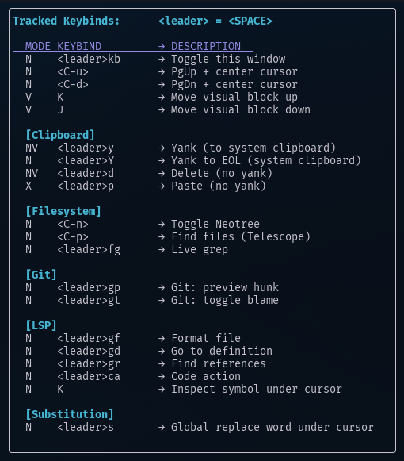

# Keybind Tracker for Neovim

Map keybindings and track them for display in a floating window (so you don't forget what they are!).



## Features

* Toggleable floating window listing keybindings
* Dynamically updates as keybindings are registered
* Simple API: wrap your mappings using `map()` to track them

> NOTE: Use this plugin's `map()` function instead of `vim.keymap.set()`

## Installation

Using [Lazy.nvim](https://github.com/folke/lazy.nvim):

```lua
{
  "yuri-rage/nvim-keybind-tracker",
  event = "VeryLazy",
  config = function()
    require("keybind-tracker").setup({
      -- optional settings (these are the defaults)
      toggle_key = "<leader>kb", -- replace with desired key
      toggle_desc = "Toggle keybinds window", -- replace with desired description
    })

    -- add additional keybinds as desired
    -- (or in init.lua using the same syntax)
    local map = require("keybind-tracker").map
    map("n", "H", "gT", { desc = "gT (previous tab)" })
    map("n", "L", "gt", { desc = "gt (next tab)" })
    map("n", "<leader>ff", require("telescope.builtin").find_files, { desc = "Find files" })
  end,
}
```

## Author's Configuration

I use the following `.config/nvim/lua/plugins/keybinds.lua` file with Lazy.nvim:
```lua
return {
    "yuri-rage/nvim-keybind-tracker",
    event = "VeryLazy",
    config = function()
        require("keybind-tracker").setup({})
        local map = require("keybind-tracker").map

        vim.keymap.set("n", "Q", "<nop>") -- disable Ex mode (untracked by keybind-tracker)

        -- motions
        map("n", "<C-u>", "<C-d>zz", { desc = "PgUp + center cursor" })
        map("n", "<C-d>", "<C-d>zz", { desc = "PgDn + center cursor" })
        map("v", "K", ":m '<-2<CR>gv=gv", { desc = "Move visual block up" })
        map("v", "J", ":m '>+1<CR>gv=gv", { desc = "Move visual block down" })

        -- substitution
        map(
            "n",
            "<leader>s",
            [[:%s/\<<C-r><C-w>\>/<C-r><C-w>/gI<Left><Left><Left>]],
            { desc = "Global replace word under cursor", group = "Substitution" }
        )

        --clipboard
        map({ "n", "v" }, "<leader>y", [["+y]], { desc = "Yank (to system clipboard)", group = "Clipboard" })
        map("n", "<leader>Y", [["+Y]], { desc = "Yank to EOL (system clipboard)", group = "Clipboard" })
        map({ "n", "v" }, "<leader>d", '"_d', { desc = "Delete (no yank)", group = "Clipboard" })
        map("x", "<leader>p", [["_dP]], { desc = "Paste (no yank)", group = "Clipboard" })

        -- Neo-tree
        map("n", "<C-n>", ":Neotree filesystem toggle left<CR>", { desc = "Toggle Neotree", group = "Filesystem" })

        -- Telescope
        local builtin = require("telescope.builtin")
        map("n", "<C-p>", builtin.find_files, { desc = "Find files (Telescope)", group = "Filesystem" })
        map("n", "<leader>fg", builtin.live_grep, { desc = "Live grep", group = "Filesystem" })

        -- LSP
        map("n", "<leader>gf", vim.lsp.buf.format, { desc = "Format file", group = "LSP" })
        map("n", "<leader>gd", vim.lsp.buf.definition, { desc = "Go to definition", group = "LSP" })
        map("n", "<leader>gr", vim.lsp.buf.references, { desc = "Find references", group = "LSP" })
        map("n", "<leader>ca", vim.lsp.buf.code_action, { desc = "Code action", group = "LSP" })
        map("n", "K", vim.lsp.buf.hover, { desc = "Inspect symbol under cursor", group = "LSP" })

        -- Gitsigns
        map("n", "<leader>gp", ":Gitsigns preview_hunk<CR>", { desc = "Git: preview hunk", group = "Git" })
        map("n", "<leader>gt", ":Gitsigns toggle_current_line_blame<CR>", { desc = "Git: toggle blame", group = "Git" })
    end,
```

## Pro Tip: Map Caps Lock to ESC

### Using QMK Keyboard Firmware

If you have a Keychron or other QMK keyboard, you can use the mod-tap feature of QMK to map Caps Lock to ESC on tap and CTRL on hold.

Follow [these instructions](https://federico.is/posts/2023/11/01/remapping-caps-lock-on-keychron-keyboard/).

If VIA does not readily connect to a Keychron keyboard, [follow these instructions](https://www.keychron.com/blogs/archived/how-to-use-via-to-program-your-keyboard) to download the JSON file and connect (was required for the Keychron Q5 Max).

### Using caps2esc at the OS (user) level

To use Caps Lock as ESC (and CTRL on hold) on Arch Linux + Wayland, follow these instructions.

Install interception-tools and the caps2esc plugin:

```bash
yay -S interception-tools interception-caps2esc  # or use pacman
mkdir -p ~/.config/interception
nvim ~/.config/interception/udevmon.yaml
```

Paste:
```yaml
- JOB: "intercept -g $DEVNODE | caps2esc | uinput -d $DEVNODE"
  DEVICE:
    EVENTS:
      EV_KEY: [KEY_CAPSLOCK, KEY_LEFTCTRL]
```

Create a user level systemd service:


```bash
mkdir -p ~/.config/systemd/user
nvim ~/.config/systemd/user/caps2esc.service
```

Paste:
```ini
[Unit]
Description=Intercept Caps Lock: Escape on tap, Ctrl on hold
After=graphical-session.target

[Service]
ExecStart=/usr/bin/udevmon -c %h/.config/interception/udevmon.yaml
Restart=on-failure

[Install]
WantedBy=default.target
```

Enable the service:

```bash
systemctl --user daemon-reexec
systemctl --user daemon-reload
systemctl --user enable --now caps2esc.service
```

You'll probably see permission errors if you issue `systemctl --user status caps2esc.service`.

Fix that with:

```bash
sudo usermod -aG input $USER
sudo modprobe uinput
sudo nvim /etc/udev/rules.d/99-uinput.rules

```

Paste:

```ini
# /etc/udev/rules.d/99-uinput.rules
KERNEL=="uinput", SUBSYSTEM=="misc", MODE:="0660", GROUP:="input"
```

Reboot, and you should be able to use Caps Lock as Escape (and vice versa).
